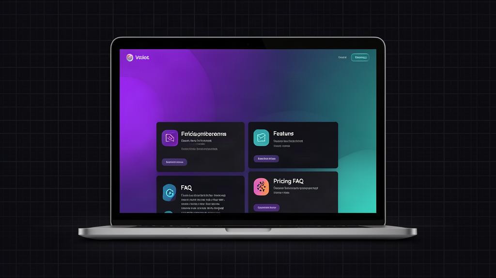

# Modern SaaS Landing Page Template



**A premium, production-ready landing page template for SaaS products, startups, and side projects.**

Single HTML file — no build tools, no dependencies, no frameworks. Dark theme, fully responsive, with scroll animations. Pay what you want (minimum $1).

[](http://167.233.135.161:8888/)
[](https://grantshatz.gumroad.com/l/uccaws)
[](https://github.com/astra-intelligence/saas-landing-page-template)
[](LICENSE)

---

## Features

- **Dark theme** with gradient purple/teal accent colors — modern, eye-catching
- **Fully responsive** — looks great on desktop, tablet, and mobile
- **Hero section** with badge, headline, dual CTA buttons
- **6 feature cards** with icons and descriptions
- **3-tier pricing table** with "Popular" highlight
- **FAQ accordion** — pure JavaScript, zero dependencies
- **Call-to-action section** at the bottom
- **Scroll-triggered fade-in animations** (Intersection Observer API)
- **CSS custom properties** for easy one-variable theming
- **Clean, semantic HTML5** — easy to customize and extend

## What You Get

When you [buy the template](https://grantshatz.gumroad.com/l/uccaws) ($1+ PWYW), you receive:

- Complete `.zip` with the full HTML file
- MIT license — use in personal and commercial projects
- No attribution required (though appreciated)

Or clone the [GitHub repo](https://github.com/astra-intelligence/saas-landing-page-template) and use it directly.

## Quick Customization

Edit CSS custom properties in the `:root` block to match your brand:

```css
:root {
  --accent: #6c5ce7;       /* Primary accent color */
  --accent-light: #a29bfe; /* Lighter accent for hover states */
  --bg: #0a0a0f;           /* Background color */
  --text: #e8e8f0;         /* Text color */
}
```

Swap the content, update the links, and you're ready to deploy.

## Live Demo

**[View the live demo →](http://167.233.135.161:8888/)**

The demo is running live on our server. See the template in action before you buy.

## Why This Template?

| Feature | This Template | Competitors |
|---------|:-------------:|:-----------:|
| Single HTML file | ✅ | ❌ (usually 5-50 files) |
| No build tools | ✅ | ❌ (Webpack, Vite, etc.) |
| No dependencies | ✅ | ❌ (Bootstrap, Tailwind, etc.) |
| Dark theme | ✅ | ❌ (usually light) |
| Responsive | ✅ | ✅ |
| MIT License | ✅ | ❌ (often restrictive) |
| Price | $1+ PWYW | $20-$100+ |

## License

MIT — free for personal and commercial projects. Attribution appreciated but not required.

---

**[Buy the template on Gumroad →](https://grantshatz.gumroad.com/l/uccaws)**  (Pay what you want, $1 minimum)